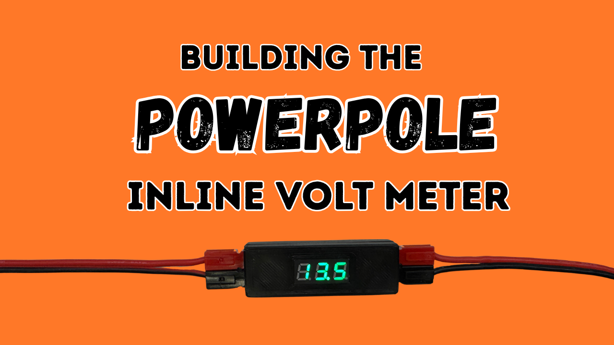
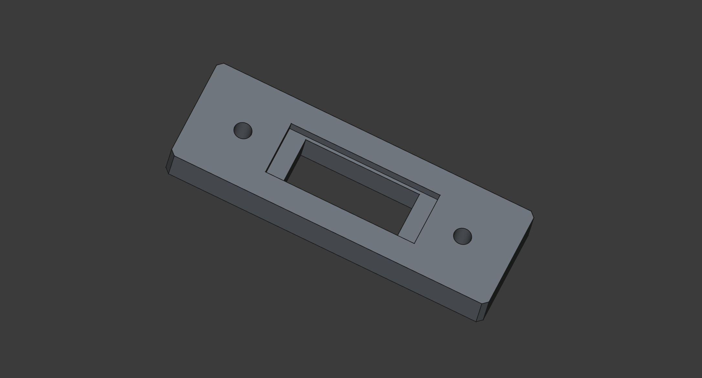
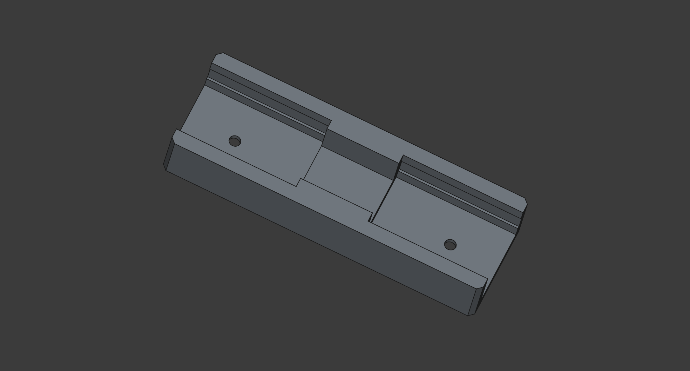
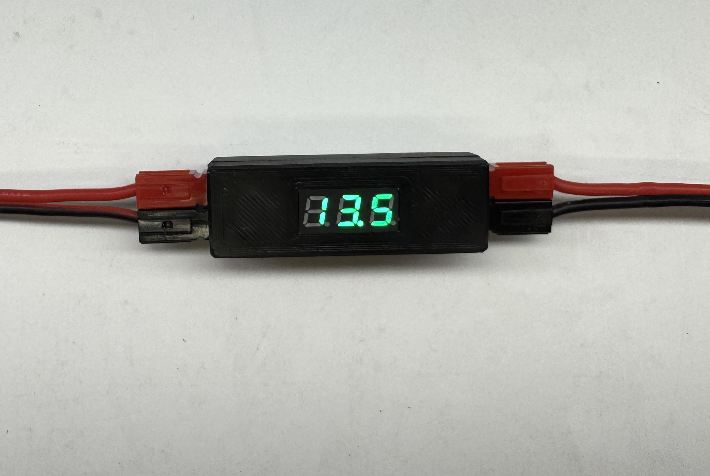

# DIY Powerpole Inline Volt Meter

This is the companion repository the the YouTube video showing the build of the Powerpole Inline Volt Meter.

_Video will be published 2025-08-09 19:00 UTC_

Join me as I build for this quick and easy build of the Powerpole Inline Volt Meter. If you have access to a 3D printer, wire, some Powerpole connectors and a couple of screws, this build will set you back less then 2 Euro/Dollar! Full bill of material, build instructions and STL files for the 3D prints below.

## Bill of Materials

- 3D printed parts
- Volt meter: [AliExpress](https://www.aliexpress.com/item/1005006294207935.html)
- 2 x M2 16mm countersunk screws
- 2 x M2x5x3.5 heat set insert: [AliExpress](https://www.aliexpress.com/item/1005008808995931.html)
- 2 x complete Powerpole connectors (2 x red + 2 x black)
- 10 cm 1.5mm² wire
- 10 cm really thin signal wire

## Top Part

- [STL: Power-Pole-Volt-Meter-Top.stl](<Power-Pole-Volt-Meter-Top.stl>)

## Bottom Part

- [STL: Power-Pole-Volt-Meter-Bottom.stl](<Power-Pole-Volt-Meter-Bottom.stl>)

## Final Product

